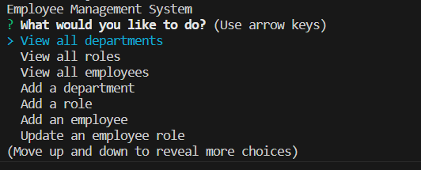
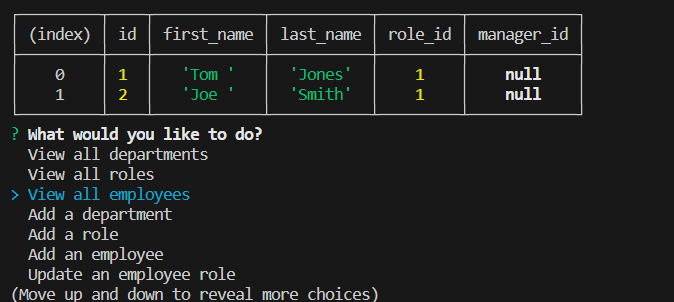

# Employee_Database_Terminal_App

## Repo Link

 https://github.com/matthewlazarowitz/Employee_Database_Terminal_App

## Screenshot

## Description

For this challenge we were tasked with building a command-line application that allows users to manage employee data in a MySQL database. The goal was to create a robust system that enables users to perform various operations such as viewing departments, roles, and employees, adding new departments, roles, and employees, updating an employee's role, and exiting the application.  To accomplish this, we utilized Node.js and MySQL as the foundation of the application. The project involved setting up the necessary dependencies, establishing a connection to the MySQL database, and implementing the required functionality using SQL queries.  The application consists of several modules and functions that handle different aspects of the employee management system. We implemented functions to retrieve and display data from the database, as well as functions to add new departments, roles, and employees. Additionally, we included a function to update an employee's role.  This assignment challenged our skills in working with databases, SQL queries, and command-line interfaces. It required us to apply our knowledge of Node.js, MySQL, and query building to build a reliable and user-friendly application. By completing this project, we gained valuable experience in managing data, performing CRUD operations, and building command-line applications.

## Installation

N/A

## Usage

This application can have merit in our lives as students, although most likely not.  It has its niche uses, such as having an accessible way to chain information and manipulate it in a easy to use terminal application.  If I were looking to possibly table workouts, recipes, etc.  This app would be of great use, and of course in a professional setting this is the cornerstone way for companies to store data.  The value is mostly found in the actual knowledge of knowing how to build these complex systems though, it is very marketable as a potential employee.

## Credits

(JD Tadlock)  (RUT-VIRT-FSF-FT-05-2023-U-LOLC)

## License

MIT License

Copyright (c) 2023 matthewlazarowitz

Permission is hereby granted, free of charge, to any person obtaining a copy
of this software and associated documentation files (the "Software"), to deal
in the Software without restriction, including without limitation the rights
to use, copy, modify, merge, publish, distribute, sublicense, and/or sell
copies of the Software, and to permit persons to whom the Software is
furnished to do so, subject to the following conditions:

The above copyright notice and this permission notice shall be included in all
copies or substantial portions of the Software.

THE SOFTWARE IS PROVIDED "AS IS", WITHOUT WARRANTY OF ANY KIND, EXPRESS OR
IMPLIED, INCLUDING BUT NOT LIMITED TO THE WARRANTIES OF MERCHANTABILITY,
FITNESS FOR A PARTICULAR PURPOSE AND NONINFRINGEMENT. IN NO EVENT SHALL THE
AUTHORS OR COPYRIGHT HOLDERS BE LIABLE FOR ANY CLAIM, DAMAGES OR OTHER
LIABILITY, WHETHER IN AN ACTION OF CONTRACT, TORT OR OTHERWISE, ARISING FROM,
OUT OF OR IN CONNECTION WITH THE SOFTWARE OR THE USE OR OTHER DEALINGS IN THE
SOFTWARE.

